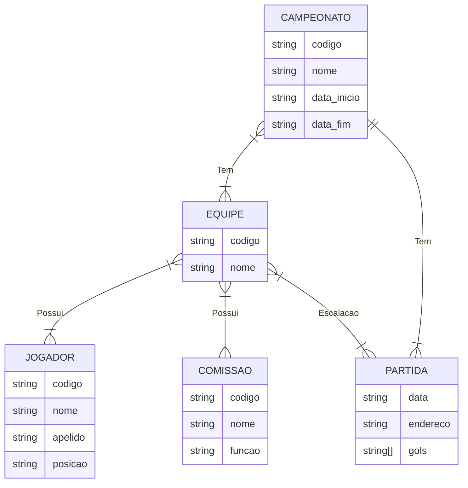
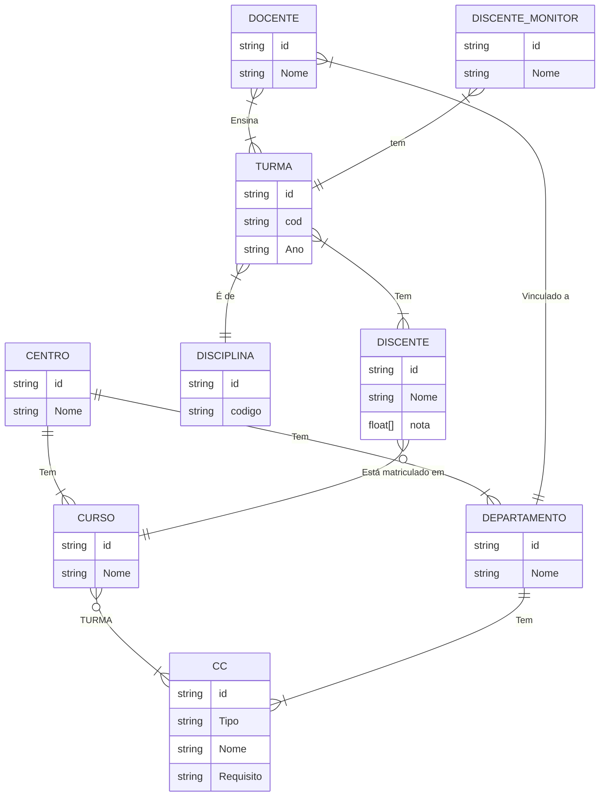
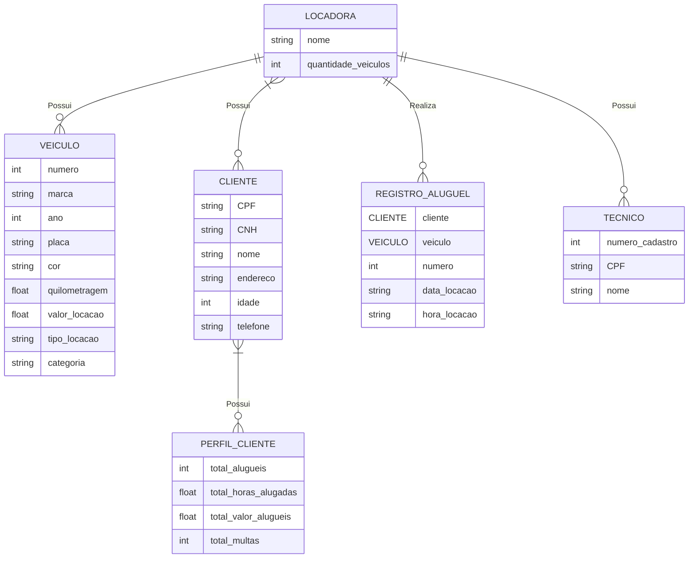
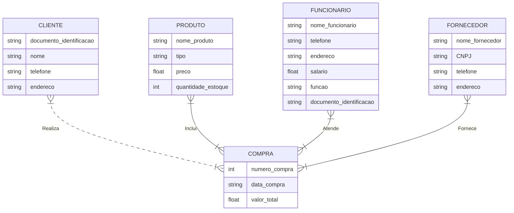

# Lista 01

## 1 - Fale o que é um SGBD e explique algumas de suas vantagens em relação aos sistemas de arquivos.

Um Sistema de Gerenciamento de Banco de Dados (SGBD) é um software projetado para gerenciar e facilitar o armazenamento, a organização, a recuperação e a manipulação de dados em um banco de dados. Ele atua como uma interface entre os usuários ou aplicativos e os dados armazenados, oferecendo várias funcionalidades que simplificam o gerenciamento de informações. Abaixo estão algumas vantagens dos SGBDs em relação aos sistemas de arquivos tradicionais:

**1 - Integridade de Dados:** Os SGBDs garantem a integridade dos dados por meio de mecanismos de restrição e validação. Isso evita a inserção de dados inconsistentes ou inválidos no banco de dados.

**2- Segurança de Dados:** Os SGBDs oferecem recursos de segurança, como controle de acesso, autenticação e autorização, que protegem os dados contra acessos não autorizados. Isso é fundamental para a conformidade com regulamentações de privacidade de dados.

**3 - Consultas Complexas:** SGBDs permitem a execução de consultas complexas em grandes conjuntos de dados usando SQL (Structured Query Language), o que é muito mais difícil e ineficiente de realizar em sistemas de arquivos.

**4 - Escalabilidade:** Os SGBDs são projetados para serem escaláveis, permitindo a expansão de capacidade à medida que a quantidade de dados e o número de usuários aumentam.

**5 - Backup e Recuperação Eficiente:** SGBDs oferecem recursos de backup e restauração de dados, tornando mais fácil a manutenção e a recuperação de informações em caso de perda ou erro.

**6 - Manutenção Simplificada:** Gerenciar dados em um SGBD é mais fácil do que gerenciar arquivos em sistemas de arquivos, especialmente quando se trata de manutenção, atualização e migração de dados.

Em resumo, um SGBD oferece várias vantagens em relação aos sistemas de arquivos tradicionais, tornando o gerenciamento de dados mais eficiente, seguro e robusto, especialmente em ambientes onde a quantidade de dados é grande e a integridade, segurança e escalabilidade são essenciais.

## 2. BD Campeonato - Construa o Diagrama Entidade Relacionamento para os requisitos:

## 3. BD Universidade - Construa o Diagrama Entidade Relacionamento para os requisitos:

## 4. BD Locadora de Veículos - Construa o Diagrama Entidade Relacionamento para os requisitos:

## 5. Entidade-Relacionamento:

